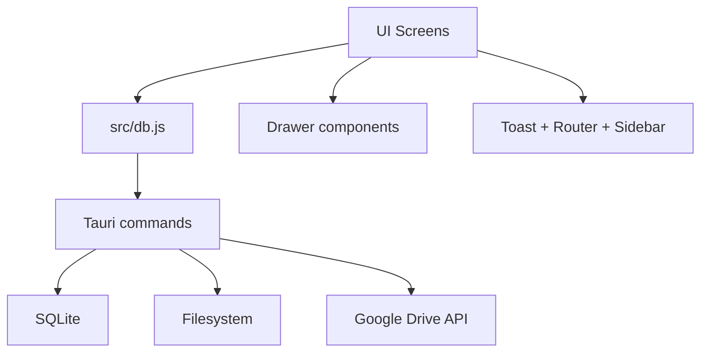
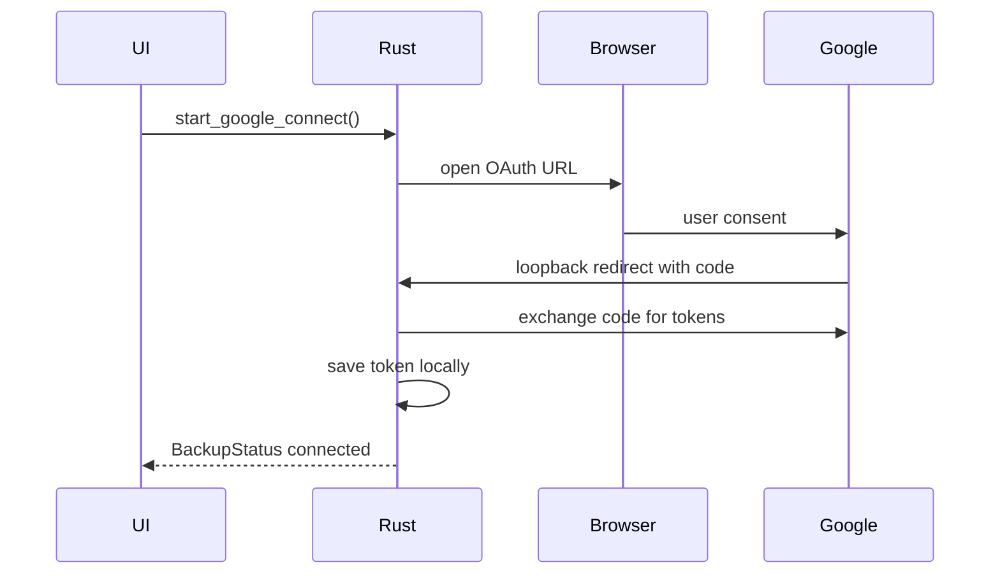

# FinLedger V1 Design

**Spec**: `.specs/features/v1-backuo and repeater/SPEC.md`  
**Status**: Ready for Tasks  
**Feature**: Backup + Importar/Exportar + Recorrentes

---

## Architecture Overview

A V1 deve preservar o fluxo atual e adicionar tres capacidades opcionais. A arquitetura proposta mantem o padrao ja adotado na V0.5:

- Frontend vanilla modularizado por tela/componente.
- `src/db.js` como unica camada que chama `invoke()`.
- Backend Rust/Tauri como dono de SQLite, filesystem e integracoes sensiveis.
- UI atualizada por callbacks apos cada mutacao.



### Implementation Order

1. **Importar / Exportar**: menor risco, aproveita tela existente e valida o caminho de dialog/file save.
2. **Recorrentes**: adiciona schema, commands, tela, drawer e geracao automatica.
3. **Backup Google Drive**: maior risco por OAuth, token e rede. A implementacao real so comeca depois que o Google OAuth Client ID estiver criado.

---

## Research Notes

- Google Drive `appDataFolder` e uma pasta oculta, privada por app, adequada para dados que o usuario nao manipula diretamente. O escopo recomendado para isso e `https://www.googleapis.com/auth/drive.appdata`.
- `drive.appdata` e listado pelo Google como escopo nao sensivel para Drive. Isso ajuda a manter o app gratuito e com permissao minima.
- Para desktop apps, o fluxo OAuth recomendado pelo Google usa navegador do sistema e redirect por loopback IP em Windows/macOS/Linux.
- O Tauri v2 tem plugin oficial de dialog para abrir dialogos nativos de salvar arquivo. A API retorna o caminho escolhido ou `null`.

Referencias:

- Google Drive app data folder: https://developers.google.com/workspace/drive/api/guides/appdata
- Google Drive API scopes: https://developers.google.com/workspace/drive/api/guides/api-specific-auth
- Google OAuth desktop apps: https://developers.google.com/identity/protocols/oauth2/native-app
- Tauri dialog plugin: https://v2.tauri.app/plugin/dialog/

---

## Code Reuse Analysis

### Existing Components to Leverage

| Component | Location | How to Use |
|---|---|---|
| Data layer | `src/db.js` | Add wrappers for new commands: export, recorrentes, backup |
| Router | `src/router.js` | Add routes for `recorrentes` and `backup` |
| Sidebar | `src/components/sidebar.js` | Replace `nav-nova` with `nav-recorrentes`; add `nav-backup`; rename import label |
| Transaction drawer | `src/components/drawer.js` | Reuse interaction pattern for recurring drawer |
| Toast | `src/toast.js` | Use for success/error feedback |
| Import screen | `src/screens/importar.js` | Keep existing import logic; add export section |
| Dashboard | `src/screens/dashboard.js` | Add recurrence marker in recent transactions |
| Transactions list | `src/screens/transacoes.js` | Add recurrence marker in table |
| SQLite state | `src-tauri/src/db/mod.rs` | Reuse shared connection model |
| Transactions commands | `src-tauri/src/db/transacoes.rs` | Extend model to include recurrence metadata |

### Integration Points

| System | Integration Method |
|---|---|
| SQLite | Add columns/table through idempotent migrations in `schema.rs` |
| CSV export | JS opens save dialog, Rust writes selected file path |
| Recorrentes | New Rust module `recorrentes.rs`; frontend uses `db.js` wrappers |
| Backup | New Rust module `backup.rs` plus Google Drive client/service module |
| OAuth | System browser via Tauri opener and local loopback callback in Rust |

---

## Data Model Changes

### Transacao

Existing table gains optional recurrence metadata.

```sql
ALTER TABLE transacoes ADD COLUMN recorrente_id INTEGER DEFAULT NULL;
```

Rationale:

- Keeps generated transactions as normal transactions.
- Allows UI to show the recurrence indicator.
- Does not require deleting generated transactions when a recurring template is removed.

Frontend/Rust type:

```ts
type Transacao = {
  id?: number
  descricao: string
  valor: number
  data: string
  tipo: "receita" | "despesa"
  categoria: string
  obs: string
  recorrente_id?: number | null
}
```

### Recorrente

```sql
CREATE TABLE IF NOT EXISTS recorrentes (
  id              INTEGER PRIMARY KEY AUTOINCREMENT,
  descricao       TEXT    NOT NULL,
  valor           REAL    NOT NULL CHECK(valor > 0),
  tipo            TEXT    NOT NULL CHECK(tipo IN ('receita', 'despesa')),
  categoria       TEXT    NOT NULL,
  obs             TEXT    DEFAULT '',
  frequencia      TEXT    NOT NULL CHECK(frequencia IN ('diaria', 'semanal', 'mensal', 'anual')),
  dia_vencimento  INTEGER NOT NULL,
  mes_vencimento  INTEGER,
  ativa           INTEGER NOT NULL DEFAULT 1,
  ultima_geracao  TEXT,
  criada_em       TEXT    NOT NULL DEFAULT current_date
);
```

Frontend/Rust type:

```ts
type Recorrente = {
  id?: number
  descricao: string
  valor: number
  tipo: "receita" | "despesa"
  categoria: string
  obs: string
  frequencia: "diaria" | "semanal" | "mensal" | "anual"
  dia_vencimento: number
  mes_vencimento?: number | null
  ativa: number
  ultima_geracao?: string | null
  criada_em: string
}
```

### Backup File

```ts
type BackupFile = {
  version: "1"
  exportedAt: string
  transacoes: Transacao[]
  categorias: Categoria[]
}
```

V1 backup intentionally excludes recurring templates for now. This follows the current backup format in the spec and the product decision made on 2026-05-10.

---

## Backend Components

### `src-tauri/src/db/schema.rs`

- Add migration for `transacoes.recorrente_id`.
- Add `recorrentes` table.
- Keep migration idempotent with `CREATE TABLE IF NOT EXISTS` and safe `ALTER TABLE` guarded by schema inspection.

### `src-tauri/src/db/transacoes.rs`

- Extend `Transacao` struct with `recorrente_id: Option<i64>`.
- Update SELECT/INSERT/UPDATE to include `recorrente_id`.
- Existing saves from UI should pass `null`/missing and continue working.

### `src-tauri/src/db/recorrentes.rs`

Commands:

```rust
get_all_recorrentes() -> Vec<Recorrente>
save_recorrente(recorrente: Recorrente) -> i64
delete_recorrente(id: i64) -> ()
toggle_recorrente(id: i64, ativa: bool) -> ()
generate_due_recorrentes(today: Option<String>) -> GenerateResult
```

`generate_due_recorrentes`:

- Runs on app startup after DB init and before frontend initial data load.
- Generates only dates `<= today`.
- Inserts generated transactions with `recorrente_id`.
- Updates `ultima_geracao` after the last generated occurrence.
- Returns counts so UI can optionally show a toast.

### `src-tauri/src/db/export.rs`

Commands:

```rust
export_transacoes_csv(start_date: String, end_date: String, path: String) -> usize
```

Behavior:

- Query transactions between selected dates inclusive.
- Sort by date descending.
- Return error if no transactions.
- Write UTF-8 CSV to selected path.
- Escape CSV cells containing comma, quote or newline.

### `src-tauri/src/backup.rs`

Commands:

```rust
get_backup_status() -> BackupStatus
start_google_connect() -> BackupStatus
disconnect_google_drive() -> ()
sync_google_drive() -> BackupStatus
restore_google_drive() -> RestoreResult
```

Responsibilities:

- Store token data under app data dir, outside SQLite.
- Never expose access/refresh token to frontend.
- Build `finledger-backup.json` from current SQLite data.
- Restore by transactionally clearing/importing local data.
- Surface only high-level status/error messages to UI.

### Google Drive Client

Implementation option:

- Rust module using HTTP client (`reqwest`) and OAuth PKCE.
- Tauri opener launches authorization URL.
- Local loopback server receives authorization code.
- Drive API endpoints manage a single file named `finledger-backup.json` in `appDataFolder`.
- Development OAuth Client ID:
  - `281581841973-detiallepdbf11dvdpj8d4tk86iu43tl.apps.googleusercontent.com`

Required additions likely include:

- Rust dependencies: `reqwest`, `url`, `sha2`, `base64`, maybe `tiny_http` or a small local server crate.
- Google OAuth Client ID for a Desktop app. Created on 2026-05-10.

Decision: do not implement a fake/placeholder Google Drive connection. The backup implementation starts only after the real OAuth Client ID exists, so the connect/sync flow can be tested against Google from the beginning.

Cost note: creating the OAuth Client ID itself is not a paid step. The V1 backup design uses only the user's own Google Drive through `drive.appdata` and does not require a paid FinLedger server.

### Sync Architecture

The app remains offline-first:

- SQLite is the source of truth.
- Google Drive is a backup/sync target, never primary storage.
- User actions save locally first and must not wait for network.
- Backup upload is asynchronous and debounced.

V1 uses a pragmatic version of queue/batching:

- Maintain a local sync state with `dirty`, `syncing`, `last_sync_at`, `last_error`, and retry metadata.
- Any transaction/category mutation marks backup state as `dirty`.
- A debounce timer batches rapid local changes into one upload of the full `finledger-backup.json`.
- If sync fails, keep `dirty = true` and retry later with exponential backoff.
- The retry state should survive app restart, but V1 does not need a per-change operation queue because the backup format is a full-state snapshot.

Critical design choice: do not implement a granular operation queue in V1 unless we later support bidirectional multi-device merge. For a single overwritten backup file, a dirty flag plus persisted retry metadata gives most of the resilience with much less complexity.

---

## Frontend Components

### `src/db.js`

Add wrappers:

```js
exportRecorrentes/getAllRecorrentes/saveRecorrente/deleteRecorrente/toggleRecorrente
generateDueRecorrentes
exportTransacoesCsv
getBackupStatus/startGoogleConnect/disconnectGoogleDrive/syncGoogleDrive/restoreGoogleDrive
```

All new `invoke()` calls remain centralized here.

### `src/screens/importar.js` and `src/screens/importar.css`

Design choice: keep filenames as `importar.*` to reduce churn, but rename UI to "Importar / Exportar".

Add export section:

- Default start/end dates to current month.
- Button opens native save dialog through Tauri dialog plugin.
- Calls `exportTransacoesCsv(start, end, path)`.
- Toasts success/error.

Required frontend dependency:

- `@tauri-apps/plugin-dialog`

Required Tauri plugin:

- `tauri-plugin-dialog`
- Capability permission: `dialog:default` or at least `dialog:allow-save`.

### `src/screens/recorrentes.js` and `src/screens/recorrentes.css`

New screen:

- Lists recurring templates.
- Empty state.
- Status badge.
- Actions: pause/resume, edit, delete.
- "Nova recorrente" opens recurring drawer.

### `src/components/recorrenteDrawer.js` and `src/components/recorrenteDrawer.css`

Reuse drawer visual pattern from transaction drawer.

Responsibilities:

- Create/edit recurring template.
- Dynamic fields by frequency.
- Validate required fields.
- Filter category select by type.
- Emit `onSave(recorrente)`.

### `src/components/sidebar.js`

Changes:

- Replace `nav-nova` behavior with `nav-recorrentes`.
- Add `nav-backup`.
- Rename visible import label to "Importar / Exportar".

### Dashboard Transaction Action

Add a "+ Nova transação" primary action to the Dashboard header. It opens the existing transaction drawer and makes the primary daily workflow available from the first screen.

### `src/screens/backup.js` and `src/screens/backup.css`

New screen:

- Disconnected state.
- Connecting state.
- Connected state with email and last sync time.
- Inline sync error.
- Restore confirmation modal.
- Cloud sync indicator can live globally in `index.html` or as part of backup module.

### `src/main.js`

Changes:

- Load recurring templates on init.
- Trigger due recurring generation before initial render, then reload transactions.
- Initialize new screens.
- Refresh backup status.
- Trigger backup sync after successful transaction/category mutations.

---

## Navigation Design

Final sidebar:

```text
VISÃO GERAL
  Dashboard

LANÇAMENTOS
  Transações
  Recorrentes

CONFIGURAÇÕES
  Categorias
  Importar / Exportar
  Backup
```

Transaction creation remains accessible through:

- New Dashboard button "+ Nova transação".
- Existing Transações button "+ Nova transação".

---

## Recurrence Generation Rules

### Date Anchor

If `ultima_geracao` is null:

- First generated date is the next valid occurrence on or before today based on the recurrence definition.
- To avoid surprise backfill to app install date, V1 should not generate dates before the recurring template creation date.

Design decision: add `criada_em` automatically and do not expose it as a visible form field. The spec does not define it, but without it a new monthly recurring item could generate old occurrences unexpectedly.

### Monthly Edge Cases

If `dia_vencimento` is greater than days in month:

- Clamp to last day of that month.
- Example: day 31 generates on Feb 28/29.

### Weekly Mapping

Spec says `0-6, dom-sab`; UI text says Segunda ... Domingo.

Design choice:

- Store `0 = domingo`, `1 = segunda`, ... `6 = sabado`.
- UI can order Monday first but save the correct numeric value.

---

## Backup Flow

### Connect



### Sync

- Sync after startup if connected.
- Sync after transaction/category save/delete.
- Debounce rapid mutations to avoid multiple uploads.
- UI shows cloud indicator while syncing.

### Restore

- UI asks confirmation.
- Rust downloads and validates backup JSON.
- Rust opens SQLite transaction:
  - delete transacoes
  - delete categorias
  - insert categories ignoring duplicate name+tipo
  - insert transactions with new IDs
- Return imported counts.

---

## Error Handling Strategy

| Error Scenario | Handling | User Impact |
|---|---|---|
| Export period has no transactions | Rust returns error | Toast "Nenhuma transação encontrada no período" |
| User cancels save dialog | Frontend stops silently | No toast needed |
| CSV write fails | Rust returns error | Toast "Erro ao exportar" |
| Recorrente invalid | Frontend validates before save; Rust also validates | Field stays open + toast |
| Generation fails on startup | Log/return error; app still opens | Toast optional, no data loss |
| Backup not connected | Sync command no-ops | No visible error |
| OAuth canceled/fails | Rust returns error status | Inline backup error |
| Drive file missing on restore | Rust returns specific error | Toast "Arquivo não encontrado no Drive" |
| Backup version unknown | Restore blocked | Toast "Erro ao restaurar backup" |
| Partial restore error | SQLite transaction rollback | Existing local data preserved |

---

## Tech Decisions

| Decision | Choice | Rationale |
|---|---|---|
| V1 task order | Export -> Recorrentes -> Backup | Moves from low-risk to high-risk |
| CSV write location | Rust command writes selected path | Avoids broad filesystem permission in JS |
| Dialog | Tauri dialog plugin | Native save dialog required by spec |
| Recurrence marker | `transacoes.recorrente_id` | Minimal schema change and clear UI indicator |
| Recurring UI | Separate drawer component | Avoids overloading transaction drawer |
| Backup storage | Token JSON in app data dir | Keeps secrets out of UI and DB |
| Backup file | Single overwrite in Drive appDataFolder | Matches spec and keeps implementation simple |
| Internal import filenames | Keep `importar.js/css` | Visible rename without unnecessary file churn |
| Google OAuth setup | Use real Desktop OAuth Client ID before backup implementation | Keeps backup testable end-to-end and avoids mock connection states |
| OAuth Client ID storage | Keep the desktop Client ID in app config/source | Desktop Client ID is not a secret; this avoids paid infrastructure and simplifies free distribution |
| Drive scope | Use only `drive.appdata` | No access to personal Drive files; supports zero-cost app strategy |
| Sync model | Offline-first full snapshot with dirty flag, debounce and backoff | Matches current backup file design without overbuilding per-operation queues |

---

## Open Questions Before Tasks

None. The V1 design is ready for task breakdown.

---

## Verification Strategy

Each implementation task should run at least:

- `npm.cmd run build`
- `cargo check` when Rust/Tauri changes

Feature-specific verification:

- Export CSV: create sample transactions, export date range, inspect CSV content.
- Recorrentes: unit-test date generation in Rust where possible; manually test diaria/semanal/mensal/anual.
- Backup: test disconnected state, connect failure, token persistence, sync payload shape, restore rollback behavior.
