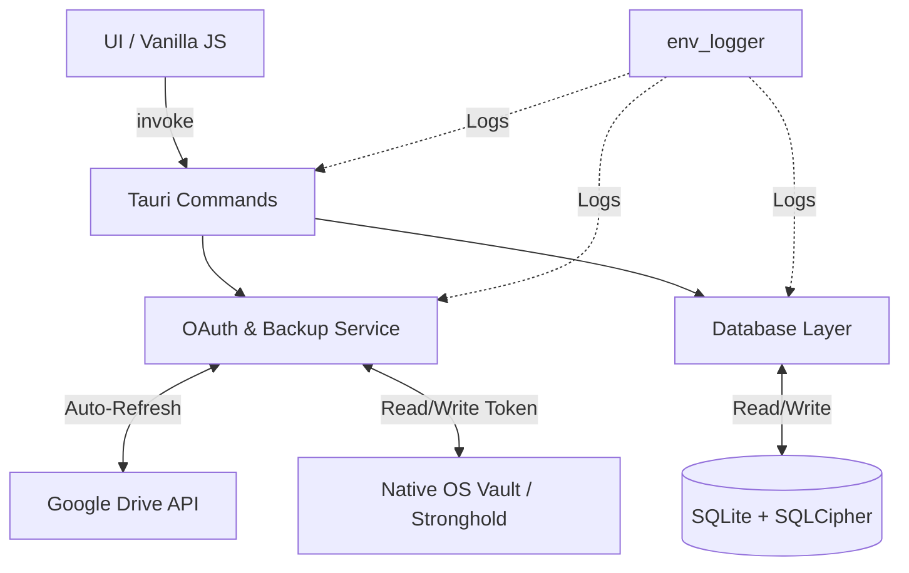

# V1.1 Quality and Security Design

**Spec**: `.specs/features/v1.1-quality-and-security/v1.1-SPEC.md`
**Status**: Draft

---

## Architecture Overview

A versão 1.1 mantém a arquitetura base do FinLedger (Tauri v2 + Rust + SQLite + Vanilla JS/CSS), mas aprofunda as camadas de segurança, padroniza a interface visual (Warm Dark) e adiciona observabilidade e testes.



---

## Code Reuse Analysis

### Existing Components to Leverage

| Component | Location | How to Use |
| --- | --- | --- |
| `finledger.db` schema | `src-tauri/src/db/schema.rs` | Aproveitar a estrutura e queries do banco, mas integrando SQLCipher para a primeira inicialização ou migração. |
| Tauri IPC Commands | `src-tauri/src/db/*.rs` | Manter as chamadas `invoke`, sem alterar as assinaturas pro frontend, exceto para acoplar os novos logs e validações de cofre. |
| Estilos CSS | `src/index.css` | Substituir integralmente os tokens antigos pelas novas CSS Variables (Warm Dark). |

### Integration Points

| System | Integration Method |
| --- | --- |
| Cofre Nativo | Substituir as queries SQLite que armazenavam os tokens de OAuth por chamadas ao cofre (`tauri-plugin-stronghold` ou `tauri-plugin-store` configurado para credenciais sensíveis). |
| Google Drive OAuth | O módulo Rust injetará uma rotina de verificação (`expires_at - now < 5min`) antes de qualquer API call para forçar o auto-refresh do token. |

---

## Components

### Frontend: Design System (Tokens)
- **Purpose**: Centralizar todas as cores, tipografia (Inter) e espaçamentos no padrão Warm Dark.
- **Location**: `src/index.css`
- **Interfaces**: Variáveis CSS `--base`, `--orange`, `--gn10`, etc.
- **Reuses**: Substitui os tokens CSS já existentes no projeto.

### Frontend: Drawer Component
- **Purpose**: Abrir formulários "Nova Transação" ou "Recorrente" lateralmente, sem mudar de tela, exibindo um overlay sobre o dashboard atual.
- **Location**: `src/components/drawer.js` / `src/components/drawer.css`
- **Interfaces**:
  - `openDrawer(title, contentHtml)`
  - `closeDrawer()`
- **Dependencies**: Listeners no DOM para a tecla Escape e clique no overlay.

### Frontend: Dashboard
- **Purpose**: Exibir o resumo financeiro mensal com um novo layout de 4 colunas, gráfico SVG de evolução com área graduada e painel de categorias.
- **Location**: `src/screens/dashboard.js`
- **Dependencies**: CSS System e chamadas `invoke` ao banco.

### Backend: Cofre Nativo (Security)
- **Purpose**: Armazenar os tokens de acesso ao Google Drive (access e refresh) de forma criptografada pelo sistema operacional.
- **Location**: `src-tauri/src/db/oauth.rs` e `src-tauri/src/db/backup.rs`
- **Interfaces**: Funções de manipulação do token que interagem com o vault nativo ao invés do SQLite.
- **Dependencies**: `tauri-plugin-stronghold` ou `tauri-plugin-store`.

### Backend: SQLCipher (Security)
- **Purpose**: Encriptar fisicamente o arquivo `finledger.db` para que os dados não fiquem em texto puro (Offline-First Secure).
- **Location**: `src-tauri/src/db/mod.rs` (ou `schema.rs`) e `src-tauri/Cargo.toml`
- **Dependencies**: Ativar a feature correspondente no `rusqlite` (como `bundled-sqlcipher`) ou adequar o `tauri-plugin-sql`.

### Backend: Observabilidade (Logging)
- **Purpose**: Registrar fluxos críticos, erros silenciosos e tentativas de conexão com o Drive sem usar `eprintln!`.
- **Location**: Módulos globais (`main.rs`, `lib.rs`) e em todas as funções de `db/`.
- **Dependencies**: Crates `log` e `env_logger`.

---

## Data Models (if applicable)

Nenhuma nova entidade de domínio (tabelas de banco de dados) será criada. O foco na modelagem muda apenas no local de armazenagem dos tokens.

### Token Storage (OS Native Vault)
```typescript
interface TokenData {
  access_token: string;
  refresh_token: string;
  expires_at: number; // Unix timestamp
}
```

---

## Error Handling Strategy

| Error Scenario | Handling | User Impact |
| --- | --- | --- |
| Refresh Token expirado/inválido | O sistema limpará os dados do cofre nativo e definirá o status local como "Desconectado". Log do erro via `log::warn!`. | O usuário verá que o backup foi desconectado na UI e precisará reconectar manualmente. |
| Banco de dados da V1 (sem cifra) encontrado na inicialização | O backend fará o backup seguro do arquivo, lerá os dados e migrará/recriará o banco usando o SQLCipher com a nova chave. | A primeira abertura da V1.1 poderá ser levemente mais demorada, garantindo não haver perda de dados. |
| Validação de formulário no Drawer | Exibição de Toast component ("Informe o valor", etc) no canto inferior direito, sem fechar o drawer. | O usuário percebe o erro instantaneamente e ajusta o preenchimento sem perder dados. |

---

## Tech Decisions (only non-obvious ones)

| Decision | Choice | Rationale |
| --- | --- | --- |
| Armazenamento Seguro de Tokens | `tauri-plugin-stronghold` | A especificação exige a remoção dos tokens do texto puro. O Stronghold provê segurança cross-platform via disco encriptado ou memória, integrado oficialmente no ecossistema Tauri. |
| Testes E2E | `WebdriverIO` | Orientado pela skill `testing-tauri-apps`. É o padrão testado e documentado no ecossistema do Tauri v2 para simular o uso real do Webview + App Nativo de maneira simultânea. |
| Refatoração de Estilos | `Vanilla CSS + BEM` | Mantém a filosofia da V0 (sem Node.js building steps pesados para Tailwind). Evita reescrita completa do boilerplate JS, acelerando o update visual e focando em segurança. |
| Observabilidade | `env_logger` + `log` | Solução nativa leve e canônica do ecosistema Rust para capturar níveis de log dinamicamente usando a flag de ambiente `RUST_LOG=debug`. |
