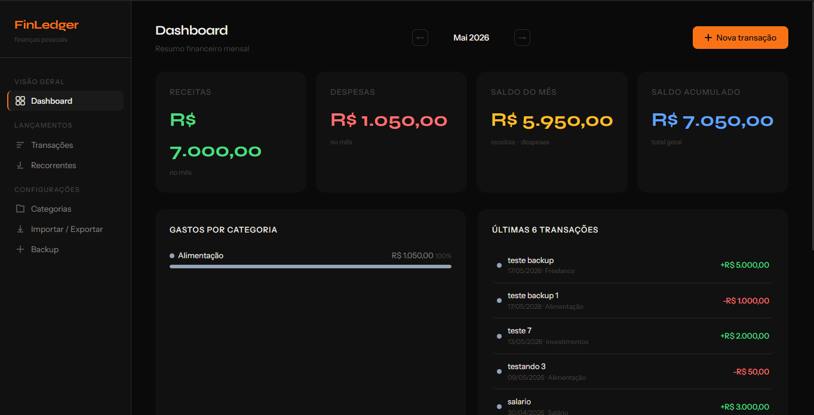

# Finn - Finanças pessoais 💰

**Finn** é um aplicativo desktop leve e rápido para gestão de finanças pessoais. Ele permite o controle offline e seguro de suas receitas e despesas, visualização de saldos mensais e importação de dados através de planilhas de forma super intuitiva.



## 🚀 Tecnologias

Este projeto foi construído focando em performance, baixo consumo de memória e total privacidade dos dados (tudo fica no seu computador).

- **Frontend:** HTML5, CSS3 e Vanilla JavaScript (sem frameworks pesados).
- **Backend:** [Tauri 2](https://v2.tauri.app/) e [Rust](https://www.rust-lang.org/) para a comunicação com o sistema operacional.
- **Banco de Dados:** SQLite embutido via `tauri-plugin-sql` para armazenar transações e categorias localmente.

## 📦 Funcionalidades Principais

- **Dashboard:** Resumo mensal do seu saldo, despesas e receitas.
- **Transações:** Listagem, filtro, busca, criação, edição e exclusão de transações.
- **Categorias:** Gerenciamento completo de categorias customizadas por cor.
- **Importação / Exportação:** Importe suas despesas em massa a partir de um arquivo de planilha (`.xlsx` ou `.csv`) e exporte seus dados facilmente para relatórios.
- **Transações Recorrentes:** Cadastre transações que se repetem (diária, semanal, mensal ou anual) e deixe o FinLedger gerá-las automaticamente para você.
- **Backup na Nuvem (Google Drive):** Sincronize seus dados de forma invisível e segura no Google Drive para nunca perder seu histórico.
- **Modo Offline-First:** Funciona sem necessidade de internet, com o banco persistido diretamente na sua máquina e sincronização silenciosa em background.

## ⬇️ Download e Instalação (Em Construção 🚧)

Uma versão com instalador pré-compilado está atualmente em desenvolvimento. 
Em breve, você poderá simplesmente baixar o executável, instalar e usar o FinLedger sem precisar de nenhum conhecimento técnico ou compilar o código-fonte! Fique de olho na aba de **Releases** deste repositório.

## 💻 Como Rodar Localmente (Para Desenvolvedores)

### Pré-requisitos
- [Node.js](https://nodejs.org/)
- [Rust](https://www.rust-lang.org/tools/install)
- Dependências de compilação do Tauri para seu SO (Siga o guia [aqui](https://v2.tauri.app/start/prerequisites/)).

### Instalação e Execução

1. Clone o repositório:
```bash
git clone https://github.com/SEU_USUARIO/finledger.git
cd finledger
```

2. Instale as dependências Node:
```bash
npm install
```

3. Configuração do Backup no Google Drive:
O FinLedger usa a API do Google Drive para sincronizar backups na nuvem. Para rodar o app localmente e compilar, você precisa das suas próprias credenciais OAuth.
- Acesse o [Google Cloud Console](https://console.cloud.google.com/).
- Crie um projeto, habilite a **Google Drive API** e configure a **Tela de Consentimento OAuth**.
- Crie credenciais do tipo **Desktop App** (Aplicativo para Computador).
- Copie o arquivo `.env.example` para `.env`:
```bash
cp .env.example .env
```
- Cole seu `Client ID` e `Client Secret` dentro do arquivo `.env`.

4. Execute em modo de desenvolvimento:
```bash
npm run tauri dev
```

5. Para compilar o executável final para o seu sistema:
```bash
npm run tauri build
```

## 📄 Licença

Este projeto é de código aberto e está licenciado sob a **GNU General Public License v3.0 (GPLv3)**. 
Isso significa que você é livre para usar, estudar, modificar e compartilhar o software. No entanto, qualquer trabalho derivado ou modificado que for distribuído também deve ser disponibilizado sob a mesma licença GPLv3 com o código-fonte aberto. O uso comercial e monetização são permitidos, desde que essas regras sejam respeitadas.
